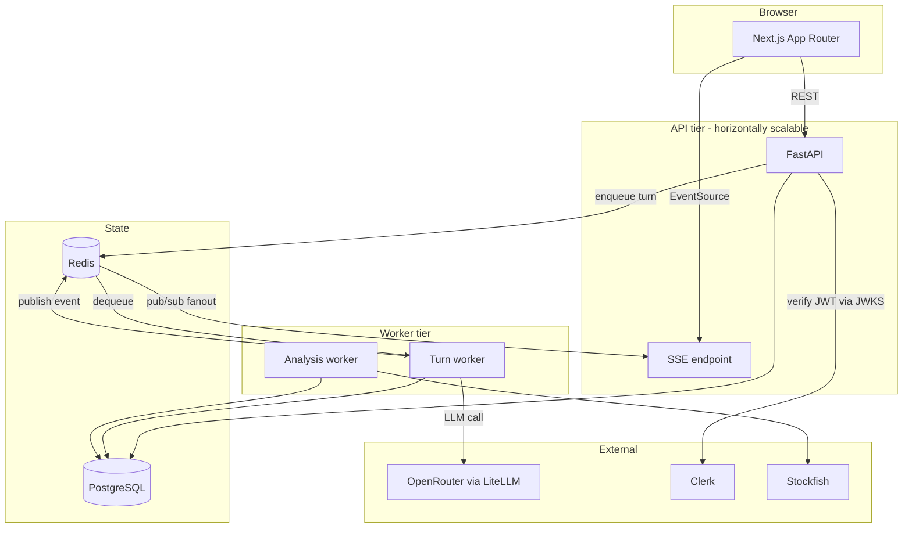
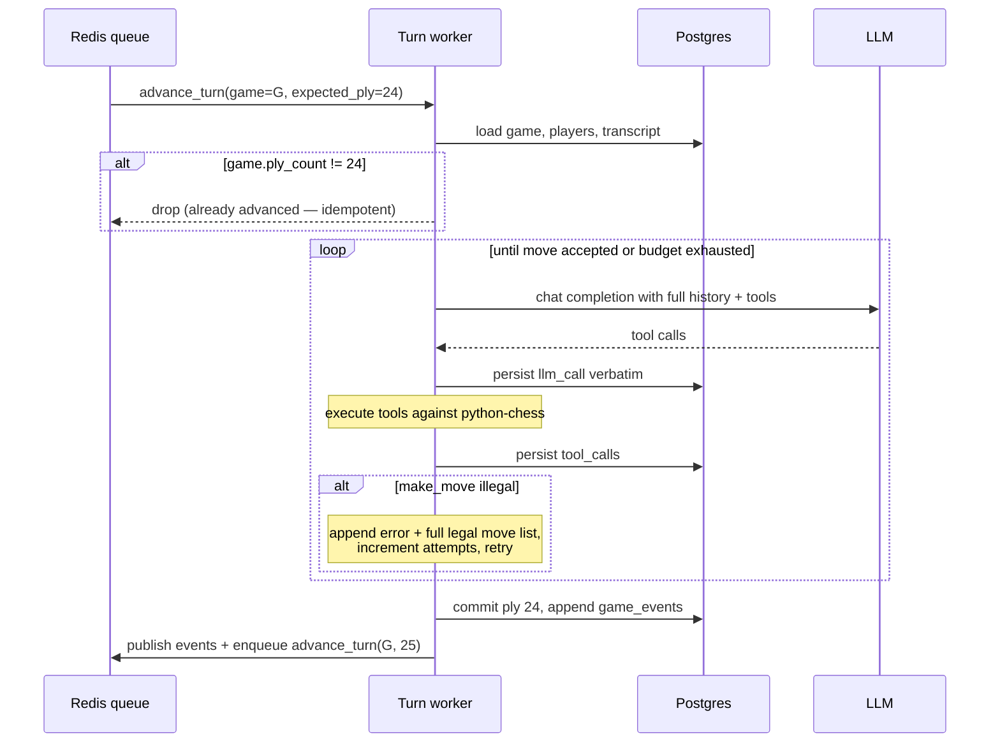
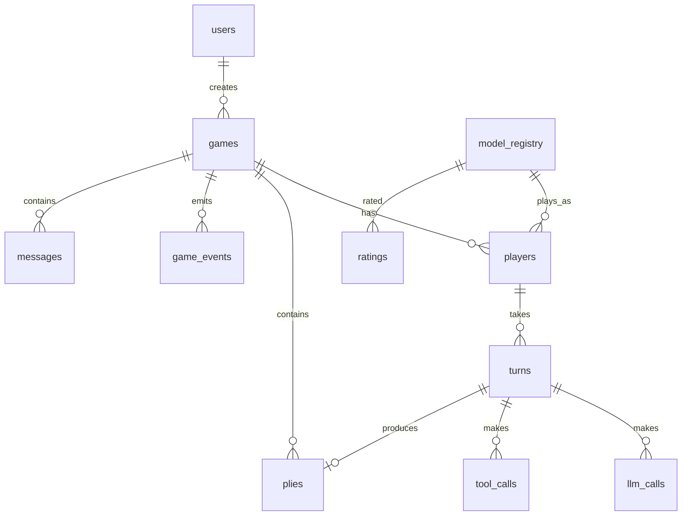

# Architecture

## Guiding constraint

Two facts drive every structural decision:

1. **A model turn takes 2–60 seconds.** It cannot happen inside an HTTP request.
2. **A game must survive a process restart.** All authoritative state lives in Postgres, never in
   process memory.

Everything below follows from those.

---

## System shape



**Why the worker tier is separate:** a model turn is long-running and expensive. Running it inside
the request/response cycle would mean a browser refresh could abort a paid LLM call, and a deploy
would kill every in-flight game. A separate worker also means the API tier stays stateless and
trivially scalable.

**Why Redis pub/sub for SSE:** with more than one API process, a spectator connected to instance A
must receive events produced by a worker talking to instance B. Redis is the fanout bus. Postgres is
the durable record; Redis is only the notification path, so a dropped Redis message is recoverable —
the client resyncs from the `game_events` table.

---

## The turn is the unit of work

The central design decision. A queued job is **not** "play game G" — it is **"advance game G from
ply N"**.



This buys three properties at once:

| Property | How |
| --- | --- |
| **Idempotency** | A job carries `expected_ply`. If the game has moved on, the job is a no-op. Redelivery is harmless. |
| **One owner per ply** | `expected_ply` covers redelivery and not *concurrency* — two jobs running at once both read the same ply and both play it. The turn takes a `FOR UPDATE NOWAIT` row lock on the game, so a second worker learns immediately and drops its job ([ADR-0022](adr/0022-one-owner-per-ply.md)). |
| **Crash resilience** | Kill the worker mid-turn: the ply was never committed, the job is redelivered, the turn simply reruns. Worst case is one wasted LLM call, never a corrupt game. |
| **Uniformity** | Human-vs-model and model-vs-model use the identical code path. A human move is just a ply committed by the API instead of by a worker; it then enqueues the same `advance_turn` job. |

---

## Agent turn loop

Within one turn, the agent runs a bounded tool-use loop:

```
build messages = [system prompt] + full game transcript
loop (bounded by max_tool_iterations and the completion-token budget — there is no per-turn clock):
    if the measured prompt is near the endpoint window:
        compact: trim stale tool results, then summarise, then shrink kept turns
        proceed only if the result actually fits
    response = llm.completion(messages, tools=TOOL_SCHEMA)
    persist llm_call verbatim (request, response, reasoning, tokens, cost, latency)
    if no tool calls:
        nudge once ("you must call a tool"); if it happens again → error_forfeit
    for each tool call:
        execute against the authoritative board
        persist tool_call
        append result to messages
    if make_move succeeded → commit ply, end turn
    if make_move illegal:
        illegal_attempts += 1
        append structured error INCLUDING the full legal move list
        if illegal_attempts > MAX_ILLEGAL_MOVE_RETRIES → illegal_move_forfeit
```

**The model never sees a board it can corrupt.** Tools are pure functions of the server-side
`chess.Board`. `get_board` reads it; `make_move` is the only mutator, and it validates before
applying.

### Tool surface

| Tool | Arguments | Returns | Mutates |
| --- | --- | --- | --- |
| `get_board` | — | FEN, ASCII diagram, side to move, castling rights, material count, check status | no |
| `get_legal_moves` | — | every legal move in SAN and UCI, with flags (capture, check, promotion) | no |
| `get_move_history` | `last_n?` | full move list in SAN with ply numbers | no |
| `make_move` | `move` (SAN or UCI) | resulting FEN, opponent's reply status, terminal state if any | **yes** |
| `say` | `message` | delivery acknowledgement | no |
| `offer_draw` | — | opponent's response | yes (game state) |
| `claim_draw` | — | draw, or a refusal naming both counters | **yes** if claimable |
| `resign` | — | game over | yes (game state) |

**On `make_move` failure**, the returned error is deliberately maximally helpful — the benchmark
measures whether a model can act correctly *given complete information*, not whether it can guess:

```json
{
  "ok": false,
  "error": "illegal_move",
  "detail": "Qh5 is not legal: the bishop on f3 is not blocking, but your queen on d1 has no path to h5.",
  "attempt": 2,
  "attempts_remaining": 3,
  "fen": "r1bqkbnr/pppp1ppp/2n5/4p3/2B1P3/5N2/PPPP1PPP/RNBQK2R b KQkq - 3 3",
  "legal_moves_san": ["Nf6", "Bc5", "d6", "..."]
}
```

**Threefold repetition and the fifty-move rule are claimed, never applied for a player**
(`claim_draw`, [ADR-0020](adr/0020-claimable-draws.md)). A refused claim is `ok: false` and is **not**
an illegal-move attempt. The hard backstops — a fivefold repetition, and seventy-five moves without
progress — always apply and need no claim, which is what keeps a game finite.

**A pawn reaching the last rank must name its piece.** `make_move` without one returns
`missing_promotion` — its own reason, and **not** an illegal-move attempt, because every other
explanation was false: `not_reachable` told a model that had found the move that its pawn could not
make it, and charged it an illegal attempt for the privilege. Promoting to a queen by default is
right almost every time and wrong in exactly the position that matters.

### Context strategy

Full transcript, every turn, engineered for prompt caching:

- The system prompt is **static** for the whole game — no move counters, no clock, nothing that
  changes per turn. Anything dynamic goes in the message body.
- Messages are strictly **append-only**. Earlier turns are never rewritten or re-summarised, so the
  prefix stays byte-identical and cacheable.
- Cache breakpoints are placed after the system prompt and at a rolling recent boundary.
- `cached_tokens` is recorded on every call; cache hit rate is a tracked metric (NFR-06).

Without caching, a 60-move game costs O(n²) in prompt tokens. With it, cost approaches linear. This
is the difference between a viable public product and an unaffordable one.

---

## Data model



| Table | Purpose | Notes |
| --- | --- | --- |
| `users` | Clerk-backed accounts | `clerk_user_id` unique; quota counters live in `usage_ledger` |
| `model_registry` | Playable models | OpenRouter slug, display name, context window, per-token pricing, reasoning support, enabled flag |
| `games` | One match | status, result, termination reason, `is_ranked`, `trash_talk_enabled`, `prompt_version`, `tool_schema_version`, `start_fen`, totals |
| `players` | Two rows per game | `color`, `kind` (model/human/engine), FK to model or user, persona, sampling params |
| `plies` | The move record | `ply_number`, SAN, UCI, `fen_before`, `fen_after`, flags — **plus nullable `eval_cp`, `cp_loss`, `classification` for BENCH-08** |
| `turns` | One agent turn | may span many LLM calls; carries `illegal_attempts`, tokens, cost, latency, outcome |
| `llm_calls` | Verbatim provider I/O | request/response JSON, reasoning text, all token counts, cost, finish reason, error |
| `tool_calls` | Every tool invocation | name, arguments, result, ok, duration |
| `messages` | Trash talk | author, ply, content, moderation status |
| `game_events` | **Ordered event log per game** | monotonic `seq`; the single source for both SSE replay and the replay UI |
| `ratings` | Glicko-2 per rating period | rating, RD, volatility |
| `analysis_jobs` | Stockfish work queue | status, engine version, depth |
| `usage_ledger` | Quota + spend accounting | per user per day |

### `game_events` is the backbone

Rather than inventing separate mechanisms for live streaming and replay, both read the same
append-only table. Event types: `game_started`, `turn_started`, `thinking`, `tool_called`,
`illegal_attempt`, `move_made`, `message_sent`, `draw_offered`, `game_ended`.

- **Live:** SSE subscribes to Redis, receives events as they're published.
- **Reconnect:** the browser sends `Last-Event-ID: <seq>`; the API replays from `game_events` where
  `seq > last`, then attaches to the live stream. No gaps (UI-10).
- **Replay:** the same rows, read in bulk and scrubbed through client-side (UI-04).

One mechanism, three features. This is the highest-leverage decision in the data model.

---

### A human seat is the same path, with one job never enqueued

Human-vs-model reuses model-vs-model whole (see *Uniformity* above), and the whole of the difference
is at the queue:

- **A turn is enqueued only when a model is to play it.** Handing the queue a job for a person's move
  produces one the worker can only answer with `awaiting_human`, and it then lingers as a stale entry
  that the human's own next job queues behind. That bug cost a full debugging pass.
- **The reconciler tells "waiting on a person" apart from "stalled"**, and expires an idle human game
  after two hours.
- **A paused game gives up after ten minutes rather than 24 hours** when a person holds a seat,
  because a person will not wait out a shared free pool ([ADR-0017](adr/0017-rate-limits-pause-games.md)).

Deliberate limitations: no clock, and a human draw offer is advisory only.

## Cost control

Enforced at four independent layers, because any single one will eventually be bypassed:

| Layer | Mechanism | Trips when |
| --- | --- | --- |
| 1. Global | Redis counter of today's spend, checked before every LLM call | daily budget exhausted → all new calls refused |
| 2. Per user | `usage_ledger` daily games + USD | user quota exhausted → cannot start a game |
| 3. Per game | Running total compared against `max_usd_per_game` | exceeded → game ends `budget_exceeded` |
| 4. Per turn | Token and wall-clock ceiling | exceeded → turn forfeits |

Cost is computed from actual returned token counts against `model_registry` pricing, written on the
`llm_call` row and rolled up to turn, game, and ledger in the same transaction. **Never estimated.**

---

## Failure handling

| Failure | Behaviour |
| --- | --- |
| Provider 5xx / timeout | Exponential backoff, up to N attempts. Does **not** count as an illegal-move attempt. Logged on the turn. |
| Provider returns no tool call | One explicit nudge message; a second occurrence forfeits with `error_forfeit`. |
| Model exceeds its context window | Detected before the call from the model's registered window; game ends `context_exceeded` rather than silently truncating. |
| Worker crash mid-turn | Ply uncommitted; job redelivered; turn reruns. One LLM call may be paid for twice — an accepted trade for never corrupting a game. |
| Redis down | Games stall but nothing is lost; on recovery a reconciler re-enqueues games whose last event is stale. |
| Postgres down | Hard stop. Readiness probe fails, no new games accepted. |
| Stockfish unavailable | Analysis jobs queue up. Live play is entirely unaffected — analysis is never in the hot path. |

---

## Security

- **No API key ever reaches the browser.** All provider calls originate in the worker tier.
- Clerk JWTs verified against cached JWKS on every protected request. Public read endpoints
  (spectating, replays, leaderboard) require no auth (AUTH-02).
- The `make_move` input is treated as untrusted and validated by `python-chess` before it can touch
  the board.
- Model-authored text is untrusted content: escaped on render, moderated before public display, and
  never interpreted as instructions by our own systems.
- Verbatim request logs are redacted of `Authorization` headers and key material before storage.

---

## Deployment

| Component | Local | Production |
| --- | --- | --- |
| Next.js | `pnpm dev` :3010 | Vercel, or the VPS behind Caddy |
| FastAPI | uvicorn :8010 | Docker on the VPS |
| Turn worker | same host | Docker on the VPS, scaled by replica count |
| Postgres | Docker :5433 | Docker on the VPS, with automated backups |
| Redis | Docker :6380 | Docker on the VPS |
| Stockfish | `apt install stockfish` | Baked into the analysis worker image |

> Ports 3010/8010/5433/6380 are deliberate — this machine already runs other projects on
> 3000/8000/5432/6379.
