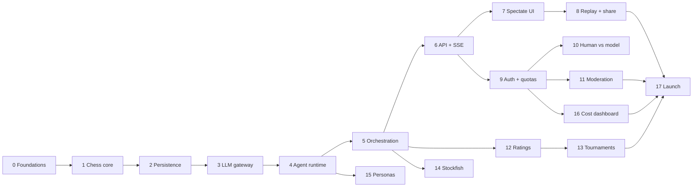

# Roadmap

## How this is structured

Phases are deliberately **small and individually testable**. Each one has:

- **Goal** — one sentence, what exists at the end that didn't before
- **Objectives** — the work
- **Exit criteria** — *verifiable* conditions. Not "it works", but "this command produces this output"
- **Covers** — requirement IDs from [REQUIREMENTS.md](REQUIREMENTS.md)

**No phase is done until its exit criteria pass and its tests are written.** A phase that "mostly
works" is not done. Deferring a test is deferring the phase.

Phases 1–5 build a fully working benchmark engine with **no UI at all** — every one of them is
testable from a terminal. That ordering is intentional: the hard, novel part is the agent runtime,
and it should be proven before a single pixel is designed.

### Dependency graph

---

## Phase 0 — Foundations ✅ COMPLETE

**Goal:** a developer can clone the repo and have every dependency running in one command.

**Objectives**
1. Monorepo layout, `.gitignore`, `.editorconfig`
2. FastAPI backend via `uv`, with ruff + strict mypy + pytest
3. Next.js 16 + TypeScript + Tailwind 4, with eslint + tsc
4. Docker Compose: Postgres 16, Redis 7, on non-conflicting ports
5. `Makefile` task runner
6. CI running lint, typecheck, tests
7. Research docs: vision, requirements, architecture, roadmap, ADRs

**Exit criteria**
- [x] `make setup && make up` brings up healthy Postgres and Redis
- [x] `make check` passes: ruff, eslint, strict mypy, tsc, pytest
- [x] `GET /health` returns `{"status":"ok","version":"0.1.0"}`
- [ ] CI is green on a push to `main`

**Covers:** OPS-01, OPS-03, OPS-06

---

## Phase 1 — Chess core domain ✅ COMPLETE

**Goal:** a complete, correct chess referee with zero knowledge of LLMs, databases, or HTTP.

**Objectives**
1. `game/board.py` — thin wrapper over `python-chess` exposing FEN, ASCII, legal moves (SAN + UCI + flags), material
2. `game/referee.py` — apply a move, detect every terminal condition, return structured results
3. `game/errors.py` — a structured illegal-move error carrying the full legal move list and a human-readable reason
4. `game/pgn.py` — export to PGN with Chessmark custom tags
5. Move parsing that accepts SAN or UCI and normalises both

**Exit criteria**
- [x] Unit tests cover all of GAME-02: castling both sides, en passant, all four promotion pieces, threefold repetition, 50-move rule, stalemate, insufficient material (all four cases)
- [x] A known PGN of a famous game replays ply-by-ply to the correct final FEN — the Opera Game (Morphy, 1858), 33 plies to `1n1Rkb1r/p4ppp/4q3/4p1B1/4P3/8/PPP2PPP/2K5 b k - 1 17`
- [x] `IllegalMoveError` for every rejection carries a non-empty `legal_moves_san` and a `detail` string
- [x] Test coverage on `game/` > 90% — **99.75%**, enforced in CI via `make cov`
- [x] Module imports nothing from `db/`, `agents/`, or `api/` — enforced by an AST test in `tests/game/test_purity.py`, which also forbids relative imports so the check cannot be sidestepped

**Covers:** GAME-01, GAME-02, GAME-04, GAME-05, GAME-06, GAME-07

**Notes**
- Threefold repetition and the fifty-move rule are applied **automatically**, deviating from FIDE
  where both are *claimable*. A benchmark cannot rely on a model noticing it may claim a draw;
  without this, two weak models shuffle until the ply cap. Documented in `referee.py`.
- Terminations are split into chess results and `FORFEIT_TERMINATIONS` (illegal-move, error,
  timeout, budget, context), so the leaderboard can separate "lost at chess" from "failed to
  operate" — the distinction the benchmark exists to measure.

---

## Phase 2 — Persistence layer ✅ COMPLETE

**Goal:** a game and its complete history can be written to Postgres and read back byte-identical.

**Objectives**
1. SQLAlchemy 2 models for every table in [ARCHITECTURE.md](ARCHITECTURE.md#data-model)
2. Alembic configured; the initial migration generated and applied
3. Async session management and repository functions
4. `game_events` append with a monotonic per-game `seq` (gap-free under concurrency)
5. Nullable evaluation columns on `plies` (BENCH-08) — present now, unused until Phase 14
6. Test fixtures: an ephemeral database per test run

**Exit criteria**
- [x] `alembic upgrade head` on an empty database creates the full schema; `downgrade base` reverses it cleanly
- [x] `alembic check` reports no drift between models and migrations
- [x] Integration test: persist a 40-ply game, reload it, and confirm the reconstructed board matches the original final FEN — the Opera Game's 33 plies, replayed from stored SAN to the exact final position
- [x] Concurrency test: 100 concurrent `game_events` appends produce `seq` 1..100 with no gaps and no duplicates
- [x] Every foreign key has an index; verified by a schema-introspection test

**Covers:** GAME-03, GAME-09 (schema), LOG-04, BENCH-08, OPS-02

**Notes**
- 13 tables. Identity rule: anything with a public identity (users, games, players, models) gets a
  **UUID** so URLs are not enumerable; append-only log rows get a **bigserial** because nothing
  outside the system addresses them.
- `game_events.seq` is allocated by `UPDATE games SET event_seq = event_seq + 1 ... RETURNING`.
  The row lock serialises concurrent appends; the unique constraint on `(game_id, seq)` is the
  backstop. **Verified with teeth:** swapping in a naive `MAX(seq)+1` makes the concurrency test
  fail with duplicate-key violations, so the test genuinely proves the mechanism.
- Money is `NUMERIC`, never float — invariant 4 says cost comes from real token counts, and a
  float would undermine that at the storage layer.
- Enums are stored as their *values* in `VARCHAR` with no database CHECK constraint. Python owns
  the allowed set; adding a termination reason should not need a migration, and a stale CHECK is a
  worse failure than a stale value.
- The test suite builds its schema by running Alembic rather than `create_all`, so every run also
  proves the migrations produce a usable database. It refuses to run against any database whose
  name does not contain `test`.

---

## Phase 3 — LLM gateway ✅ COMPLETE (one criterion deferred, see below)

**Goal:** one function call reaches any OpenRouter model and records everything about it.

**Objectives**
1. `agents/llm.py` — a LiteLLM wrapper targeting OpenRouter, with tool-calling and streaming
2. `model_registry` seeded from OpenRouter's model list: pricing, context window, reasoning support
3. Verbatim request/response capture with secret redaction (LOG-01)
4. Exact cost computation from returned token counts (LOG-02)
5. Reasoning-trace extraction across differing provider shapes
6. Prompt-cache configuration and `cached_tokens` capture
7. Retry with exponential backoff on transient errors (AGENT-09)

**Exit criteria**
- [x] Unit tests with recorded fixtures cover ≥3 provider response shapes — 2 **live recordings** (`openai/gpt-oss-20b:free`, `nvidia/nemotron-nano-9b-v2:free` with a real reasoning trace) plus 3 **hand-authored** shapes for what the free tier cannot reach: Anthropic-style usage/thinking blocks, malformed tool arguments, and a prose-only reply
- [x] Computed USD cost matches a hand-calculated value for a known token count, to the cent — 1M prompt + 100k completion at GPT-4o rates = exactly `$3.50`
- [x] No stored payload contains an API key — asserted over every committed fixture and over live gateway output
- [x] A simulated 500 retries and then succeeds; a simulated 400 does not retry
- [x] `make smoke-llm` makes one real cheap call end to end and prints tokens, cost, and latency
- [ ] **DEFERRED —** Second call with an identical prefix reports `cached_tokens > 0`

**Covers:** LOG-01, LOG-02, AGENT-09, UI-07, NFR-06 (partial — see below)

**Notes**
- **Testing never calls a provider.** Fixtures in `tests/fixtures/llm/` are replayed; a missing
  cassette raises rather than falling back to a live call. Recording is a deliberate, manual
  `make record-llm`. The suite is therefore free to run, deterministic, and unaffected by
  provider outages or rate limits.
- Every fixture declares `source: live | synthetic`, and a test fails if a synthetic one does not
  say `HAND-AUTHORED` in its note — a reader must never mistake a shape written from the docs for
  a recorded one.
- Cost has three tiers of authority: what OpenRouter says it charged, then token counts times
  registry pricing, then zero flagged `UNKNOWN`. A missing price is visible as missing rather than
  silently appearing free.
- Retry classification errs toward *not* retrying: an unrecognised error is fatal, because a retry
  loop on a permanent failure spends the budget several times for nothing. Provider retries are
  strictly separate from illegal-move retries — a flaky network must never affect a benchmark score.

**Why the cache criterion is deferred**

`cached_tokens` capture, the `cache_hit_rate` metric, and cached-rate billing are all implemented
and tested against fixtures. They cannot be *verified live* yet: OpenRouter's free tier does not
report cached tokens, and the free models available to us do not do prompt caching at all. The
smoke run confirms this — two calls sharing a 956-token prefix both reported `cached: 0 (0%)`.

Verifying NFR-06 for real needs a caching-capable model, which needs credits. Re-run
`make smoke-llm` once that exists; no code change is expected, but the claim is unproven until
someone checks.

---

## Phase 4 — Agent runtime

**Goal:** given a board position, an LLM agent produces a legal move — or forfeits correctly.

**Objectives**
1. Tool schemas for all seven tools (AGENT-02), versioned
2. Tool dispatch executing against the authoritative board
3. Transcript builder: static system prompt + append-only message list
4. The bounded turn loop, with illegal-move retry feeding back the full legal move list
5. Forfeit paths: `illegal_move_forfeit`, `timeout`, `budget_exceeded`, `error_forfeit`
6. `say` tool with length cap and per-turn rate limit
7. **A scripted fake LLM** that replays a canned sequence of tool calls — the key testing primitive

**Exit criteria**
- [ ] With the fake LLM, a turn that proposes 5 illegal moves then 1 legal move commits the legal move and records `illegal_attempts = 5`
- [ ] With the fake LLM, a turn that proposes 6 illegal moves ends the game with `illegal_move_forfeit`
- [ ] Every illegal-move tool result contains the complete legal move list for that position
- [ ] A turn that never calls a tool is nudged once, then forfeits `error_forfeit`
- [ ] Two consecutive turns produce message lists where the second is a strict prefix-extension of the first (asserted byte-wise — this is what makes caching work)
- [ ] `say` output over the length cap is rejected; the 4th `say` in one turn is rejected
- [ ] Test coverage on `agents/` > 85%
- [ ] **Live test:** one real cheap model plays 10 plies from the start position without a crash

**Covers:** AGENT-01 → AGENT-11, TALK-01, TALK-04, LOG-03, GAME-08, NFR-07

---

## Phase 5 — Match orchestration ⭐ First milestone

**Goal:** `make play --white=X --black=Y` runs a complete model-vs-model game to a real chess ending, headless, fully logged.

**Objectives**
1. Redis-backed job queue for `advance_turn`
2. The turn worker process
3. Idempotency via `expected_ply` (a redelivered job is a no-op)
4. Automatic enqueue of the next turn after each committed ply
5. Emission of `game_events` for every state change
6. Per-game budget enforcement and the ply cap
7. A CLI to start a game and follow it in the terminal
8. A resumption reconciler for games stalled by a crash

**Exit criteria**
- [ ] Two cheap models play a full game to a legitimate terminal state (checkmate, draw, or forfeit) with no manual intervention
- [ ] The terminal shows the board, moves, and any trash talk live
- [ ] Postgres holds: every ply, every turn, every LLM call verbatim, every tool call, every event
- [ ] Killing the worker mid-turn and restarting it resumes the game to completion (OPS-05)
- [ ] Replaying an `advance_turn` job for an already-advanced ply is a no-op, asserted by a test
- [ ] A game configured with a $0.01 cap ends as `budget_exceeded`
- [ ] Cost-per-ply is logged, and the ratio of prompt tokens to cached tokens is reported at game end

> **At the end of this phase, Chessmark works.** Everything after adds surface, safety, and audience.

**Covers:** GAME-07, AGENT-08, AUTH-04, OPS-05, LOG-07

---

## Phase 6 — API + SSE

**Goal:** the game engine is reachable over HTTP, and a client can watch a game live.

**Objectives**
1. REST: create game, get game, list games (live/recent), get plies, get transcript, list models
2. `GET /games/{id}/events` as SSE, backed by Redis pub/sub
3. `Last-Event-ID` support replaying from `game_events` before attaching live (UI-10)
4. Pydantic response schemas; OpenAPI kept accurate
5. Readiness probe checking Postgres and Redis

**Exit criteria**
- [ ] `curl -N .../events` streams events live as a worker plays a game
- [ ] Disconnecting mid-game and reconnecting with `Last-Event-ID` delivers exactly the missed events, in order, with no gaps or duplicates
- [ ] Two API processes both stream events produced by one worker (proves the Redis fanout)
- [ ] p95 latency on non-LLM endpoints < 200 ms under a 50-RPS load test (NFR-01)
- [ ] SSE delivery p95 < 500 ms after ply commit (NFR-02)
- [ ] Every endpoint has a contract test; OpenAPI validates

**Covers:** UI-10, NFR-01, NFR-02, OPS-06

---

## Phase 7 — Spectate UI

**Goal:** open a URL, watch two models play, read their reasoning, watch them trash-talk.

**Objectives**
1. Design system: typography, colour, layout, dark mode
2. Board component (`react-chessboard`) with move animation and last-move highlight
3. Live game page: board, two agent panels, move list, chat column
4. An `EventSource` hook with reconnect and cursor resume
5. Lobby: live games, recent games, start a new game
6. Model picker showing pricing, context window, and reasoning support
7. Responsive down to mobile

**Exit criteria**
- [ ] A visitor starts a model-vs-model game from the lobby and watches it to completion without a refresh
- [ ] Board, move list, and chat all update within 1s of a ply committing
- [ ] Killing and restoring the network reconnects and backfills missed plies with no visible gap
- [ ] Usable at 375px width
- [ ] Lighthouse performance and accessibility both ≥ 90
- [ ] Reasoning is **not** present in any mid-game network payload (AGENT/HUMAN-07), asserted by a test

**Covers:** UI-01, UI-02, UI-03, UI-07, HUMAN-07

---

## Phase 8 — Replay & sharing

**Goal:** any finished game is a permanent, shareable, scrubbable artefact.

**Objectives**
1. Replay page with a ply scrubber, keyboard navigation, and autoplay
2. Reasoning, tool calls, and chat synced to the selected ply
3. A raw transcript inspector showing verbatim LLM request/response per turn
4. PGN download
5. Public share URLs with OpenGraph preview cards rendering the final position
6. Object-storage offload for large payloads (LOG-05)

**Exit criteria**
- [ ] Scrubbing to ply N shows exactly the board, reasoning, tool calls, and messages as of ply N
- [ ] The exported PGN opens correctly in Lichess and in SCID
- [ ] A share link works logged-out and renders a correct social preview
- [ ] Every leaderboard-relevant number on a game page links to the raw artefact that produced it (LOG-07)

**Covers:** GAME-05, UI-04, UI-06, LOG-05, LOG-07, HUMAN-06

---

## Phase 9 — Auth, quotas & cost control

**Goal:** the app can be exposed to the internet without risking the API budget.

> **Hard gate: nothing is deployed publicly before this phase passes.**

**Objectives**
1. Clerk on the frontend; JWKS verification in FastAPI
2. `users` provisioned on first login via webhook
3. Per-user daily game and USD quotas via `usage_ledger`
4. Global daily spend kill switch, backed by a Redis counter
5. Rate limiting on game creation and every model-triggering endpoint
6. Public read endpoints remain unauthenticated
7. Admin surface: spend, cancel a game, reset a quota

**Exit criteria**
- [ ] An unauthenticated request to create a game returns 401; spectating and replays return 200
- [ ] A forged/expired JWT is rejected — asserted by a test
- [ ] A user at their daily quota is refused with a clear message; the counter resets at UTC midnight
- [ ] With the global budget tripped, **no LLM call is issued** — asserted by a test that fails if the provider is called
- [ ] Load test: 100 rapid game-creation requests from one user are rate-limited, not served
- [ ] No API key appears in any client bundle — asserted by grepping the built output in CI

**Covers:** AUTH-01 → AUTH-08

---

## Phase 10 — Human vs model

**Goal:** you sit down and play a model.

**Objectives**
1. Play page: draggable board, client-side legality preview, server-authoritative validation
2. Human move endpoint that commits a ply and enqueues the model's turn
3. Resume an in-progress game after a reload
4. Optional clock; idle games auto-expire
5. Resign and offer-draw controls
6. Post-game reveal of the model's full reasoning
7. Optional human→model chat (TALK-06)

**Exit criteria**
- [ ] A full human-vs-model game completes, with the model replying within a few seconds per move
- [ ] An illegal human move is refused both client-side and server-side; a crafted API request bypassing the client is still refused
- [ ] Reloading mid-game restores the exact position and history
- [ ] An abandoned game expires and is recorded as such
- [ ] Reasoning is inaccessible via any endpoint until the game is over (HUMAN-07)

**Covers:** HUMAN-01 → HUMAN-06, TALK-06, GAME-08

---

## Phase 11 — Moderation & safety

**Goal:** models cannot publish something under our name that we'd have to apologise for.

**Objectives**
1. A moderation check on every message before public display
2. Blocked messages stored and flagged, never silently dropped (research integrity)
3. A trash-talk system-prompt guardrail: competitive banter, not slurs or harassment
4. Trash talk off by default for ranked games (TALK-03)
5. A user report control and an admin review queue

**Exit criteria**
- [ ] A message containing known-bad content is blocked from display but present in the database with `moderation_status = blocked`
- [ ] Ranked games have `trash_talk_enabled = false` and produce zero messages, asserted by a test
- [ ] The moderation provider being down fails **closed** (message withheld), never open
- [ ] Prompt-injection attempts inside model messages do not alter our system behaviour — covered by explicit tests

**Covers:** TALK-03, TALK-05

---

## Phase 12 — Ratings & leaderboard

**Goal:** a public, defensible ranking of models.

**Objectives**
1. Glicko-2 implementation with rating periods
2. A rating job over completed ranked games
3. Aggregate metrics per model: illegal-move rate, mean cost/game, mean latency/move, forfeit breakdown
4. Leaderboard page with sorting and drill-down to games
5. A methodology page stating exactly how ranking works and where it's weak (BENCH-10)

**Exit criteria**
- [ ] The Glicko-2 implementation reproduces the worked example from Glickman's paper to 3 decimal places
- [ ] Only games with `is_ranked = true` affect ratings, asserted by a test
- [ ] Every leaderboard row drills through to the games that produced it
- [ ] Ratings recomputed from scratch reproduce the stored values exactly (determinism test)
- [ ] The methodology page is written and linked from the leaderboard

**Covers:** BENCH-01, BENCH-02, BENCH-03, BENCH-04, BENCH-10, UI-05

---

## Phase 13 — Tournaments

**Goal:** the leaderboard fills itself overnight.

**Objectives**
1. Tournament model: round robin and Swiss
2. A scheduler generating pairings and enqueueing games with bounded concurrency
3. Tournament budget caps, independent of user quotas
4. Tournament standings pages
5. Recurring scheduled tournaments

**Exit criteria**
- [ ] An 8-model double round robin (56 games) completes unattended within its budget
- [ ] A crash mid-tournament resumes without replaying completed games
- [ ] Standings match a hand-computed result for a fixed fixture set
- [ ] Total spend stays within the configured cap, asserted by a test

**Covers:** BENCH-05

---

## Phase 14 — Stockfish analysis & engine ladder

**Goal:** move quality is measured absolutely, not just relatively.

**Objectives**
1. Stockfish in the analysis worker image
2. Post-game annotation: per-ply eval, centipawn loss, blunder/mistake/inaccuracy, accuracy %
3. Backfill of all historical games
4. Stockfish as a playable opponent at capped Elo (`UCI_LimitStrength`)
5. An engine ladder anchoring the Glicko scale
6. Evaluation graph on the replay page

**Exit criteria**
- [ ] A known blunder from a test PGN is classified as a blunder at the configured depth
- [ ] Annotation runs strictly as a background job — proven by a test showing live play is unaffected when the analysis queue is saturated
- [ ] Stockfish configured to 1400 Elo scores within an expected band against a fixed opponent over 20 games
- [ ] All historical games are backfilled with no gaps
- [ ] Analysis is deterministic for a fixed engine version and depth

**Covers:** BENCH-06, BENCH-07, GAME-04 (adjudication)

---

## Phase 15 — Personas & prompt experiments

**Goal:** the trash talk gets genuinely funny, and prompt sensitivity becomes measurable.

**Objectives**
1. Persona model: named system-prompt variants
2. A curated persona set, plus user-authored personas
3. Persona games flagged non-ranked (AGENT-12)
4. A prompt-experiment harness: same model, varied prompt, compared results
5. The board-representation ablation (FEN vs ASCII vs move list) from the vision's open questions

**Exit criteria**
- [ ] Persona games never affect ratings, asserted by a test
- [ ] The experiment harness runs an N-game matched comparison and reports a result with confidence intervals
- [ ] The board-representation ablation is run and its result written up in `docs/experiments/`

**Covers:** AGENT-12, AGENT-13, BENCH-09

---

## Phase 16 — Cost & token dashboard

**Goal:** we know exactly where the money goes.

**Objectives**
1. Aggregation of spend by model, game, user, and day
2. A dashboard: spend over time, cost per game by model, cache hit rate, token mix
3. Per-game cost breakdown on the game page
4. Budget alerts before caps trip

**Exit criteria**
- [ ] Dashboard totals reconcile exactly with the sum of `llm_calls.cost_usd`
- [ ] Cache hit rate is reported and confirms NFR-06 (>80%) or flags the gap explicitly
- [ ] An alert fires at 80% of the daily budget

**Covers:** UI-08, LOG-02

---

## Phase 17 — Production hardening & launch

**Goal:** it's public, and it stays up.

**Objectives**
1. Production Compose stack on the VPS, behind Caddy with TLS
2. CI/CD from `main`
3. Sentry, uptime monitoring, alerting
4. Automated Postgres backups with a **tested restore**
5. Load test at target concurrency (NFR-03, NFR-04)
6. Security review: dependency audit, headers, CORS, rate limits
7. Launch content: an about page, the methodology page, seeded games

**Exit criteria**
- [ ] Push to `main` deploys within 10 minutes (NFR-09)
- [ ] 50 concurrent games and 200 spectators sustained without degradation
- [ ] A backup is restored to a scratch database and verified — not just taken
- [ ] Zero high-severity findings in the dependency audit
- [ ] Deliberately killing each container in turn causes no data loss and recovers automatically
- [ ] The site is live on its domain with valid TLS

**Covers:** OPS-04, OPS-07, OPS-08, NFR-03, NFR-04, NFR-09

---

## Deferred (explicitly not this cycle)

| Item | Requirement | Why deferred |
| --- | --- | --- |
| Bring-your-own API key | AUTH-09 | Server keys plus caps are sufficient until cost actually becomes the binding constraint |
| Spectator chat | TALK-07 | Moderation burden far exceeds the value |
| Chess variants | — | Standard chess first; variants dilute the benchmark |
| Multi-agent teams | — | Interesting, but a different benchmark |
| Non-chess tasks | — | Explicit non-goal (see VISION) |
